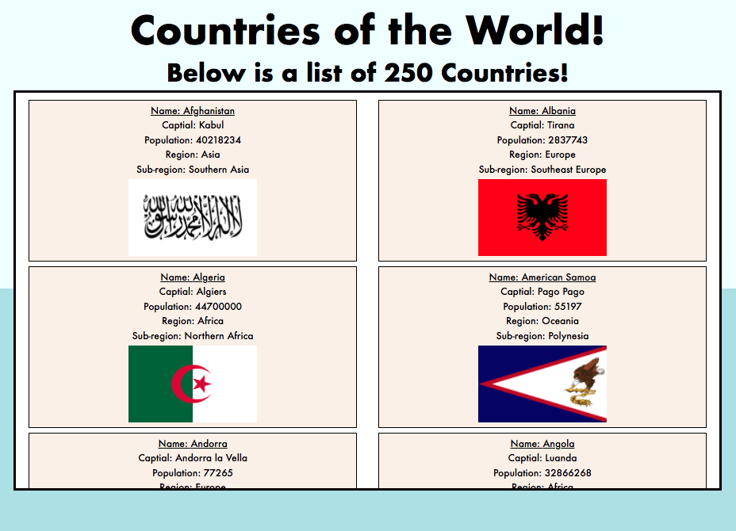
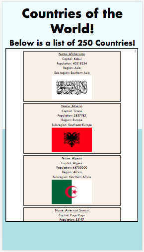

# Countries of the World.

This is a simple web-application that displays basic information of the countries of the world.

## Build with:
* React.js
* CSS
---
## App Image: In-use Image.

---
## App Image: Responsive Example.

